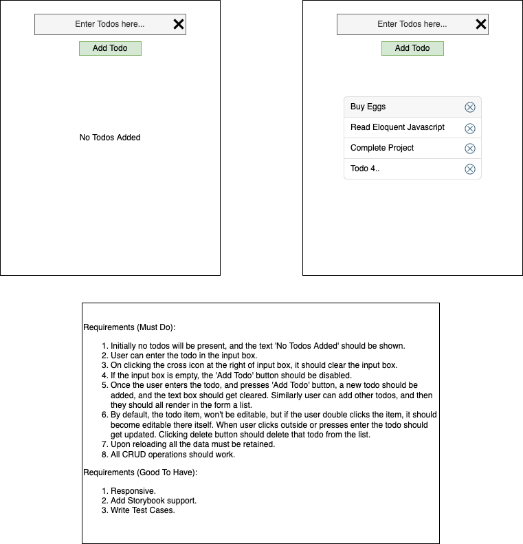

# Todo Application using ReactJS + Redux Toolkit + MaterialUI

## Problem Statement

## Approach / Design

1. Deciding the tech stack that I'll be using:

   - ReactJS
   - Redux (Redux Toolkit + react-redux)
   - MaterialUI

2. Components:

   - Todo: Wrapper component that contains all other components
   - TodoInput: Input component to manage the input given by the user.
   - NoTodosAdded: To be displayed, in case no todos are present.
   - TodoList: Componennt to display the list of all todos.
   - TodoListItem: A particular todo list item.

3. State Management:

   - We'll be using redux/toolkit for the projet, keeping in mind the scalability.

## Final Output
